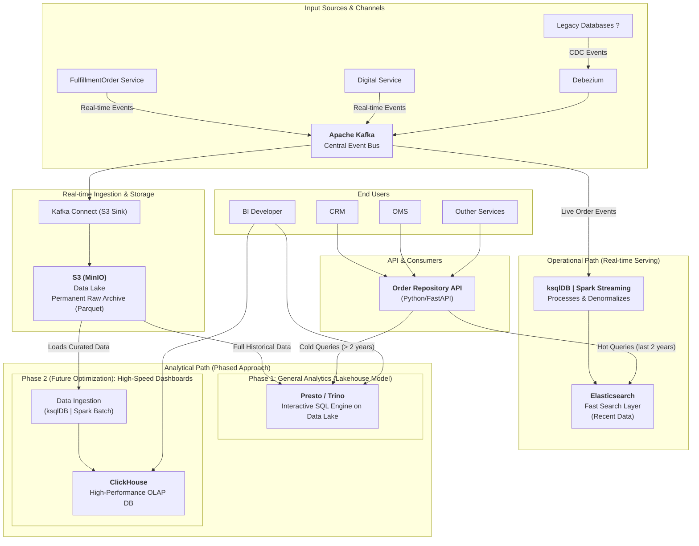

# Order Repository Service
**Order Repository Service** is a specialized microservice designed to provide efficient and structured access to **Order Management System (OMS)** data. It acts as a centralized read layer for all order-related data, serving both **Operational** and **Analytical** needs through two distinct access paths:

## Operational Path

Provides real-time, transactional views of order data optimized for operational use cases. This includes up-to-date details about orders, statuses, line items, fulfillment, and other data critical for day-to-day workflows.

## Analytical Path

Delivers denormalized, business-oriented views of order data tailored for analytical, reporting, and decision-making processes. This path is optimized for querying patterns related to KPIs, business metrics, and aggregations.

## Key Features

- Unified access to OMS order data  
- Separation of concerns between real-time operations and analytical needs  
- Flexible APIs for both granular and high-level order insights  
- Scalable architecture suitable for enterprise-grade systems  

## Use Cases

- Customer service applications needing real-time order tracking  
- BI tools generating sales reports and operational dashboards  
- Backend services that require clean, query-optimized access to order data  

## High-Level Architecture

