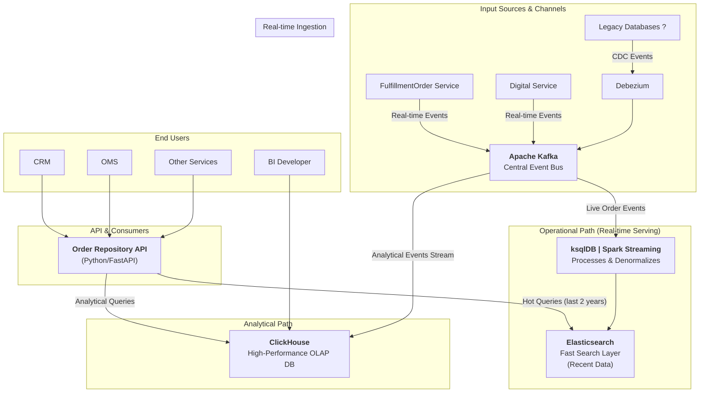

# Order Repository Service
**Order Repository Service** is a specialized microservice designed to provide efficient and structured access to **Order Management System (OMS)** data. It acts as a centralized read layer for all order-related data, serving both **Operational** and **Analytical** needs through two distinct access paths:

## Operational Path

Provides real-time, transactional views of order data optimized for operational use cases. This includes up-to-date details about orders, statuses, line items, fulfillment, and other data critical for day-to-day workflows.

## Analytical Path

Delivers denormalized, business-oriented views of order data tailored for analytical, reporting, and decision-making processes. This path is optimized for querying patterns related to KPIs, business metrics, and aggregations.

## Key Features

- Unified access to OMS order data  
- Separation of concerns between real-time operations and analytical needs  
- Flexible APIs for both granular and high-level order insights  
- Scalable architecture suitable for enterprise-grade systems  

## Use Cases

- Customer service applications needing real-time order tracking  
- BI tools generating sales reports and operational dashboards  
- Backend services that require clean, query-optimized access to order data  

## High-Level Architecture



## Prerequisites

- **Python 3.13+** - Required for running the service
- **uv** - Fast Python package manager for dependency management
- **Docker & Docker Compose** - For running the infrastructure stack
- **Make** - For using the provided automation scripts

## Quick Start

### 1. Setup Development Environment

First, set up the required tools:

```bash
# Install uv (if not already installed)
make setup

# Install project dependencies
make install-dev
```

### 2. Start Infrastructure Stack

Launch the required services using Docker Compose:

```bash
# Start all infrastructure services (Kafka, Elasticsearch, Schema Registry, etc.)
docker-compose up -d

# Verify services are running
docker-compose ps
```

### 3. Initialize Data Infrastructure

Set up Elasticsearch indices and register Avro schemas:

```bash
# Setup Elasticsearch indices with proper mappings
make manage-es-indices

# Register Avro schemas with Schema Registry
make register-schemas

# Deploy Kafka Connect sink connector for orders
make deploy-connector-es-orders
```

### 4. Run the Service

Start the Order Repository Service:

```bash
# Run the service locally
python manage.py 
# or 
uv run uvicorn src.main:app --reload --host 0.0.0.0 --port 8100
```

The API will be available at `http://localhost:8100` with interactive documentation at `http://localhost:8100/docs`.

## Development Workflow

### Environment Management

```bash
# Install dependencies (production only)
make install

# Install with development dependencies
make install-dev

# Add a new dependency
make add PACKAGE=requests

# Add a development dependency
make add-dev PACKAGE=pytest

# Remove a dependency
make remove PACKAGE=requests

# Update all dependencies
make update
```

### Code Quality

```bash
# Format code using Black
make format

# Run linters (ruff + mypy)
make lint

# Run tests
make test

# Run pre-commit hooks
make pre-commit

# Run full CI pipeline locally
make ci
```

### Infrastructure Management

```bash
# Elasticsearch Operations
make update-es-mapping          # Update index mappings
make manage-es-indices          # Setup, ensure, and rollover indices

# Schema Registry Operations
make register-schemas           # Register Avro schemas

# Kafka Connect Operations
make deploy-connector-es-orders # Deploy Elasticsearch sink connector
make status-connector-es-orders # Check connector status
```

### Docker Operations

```bash
# Build Docker image
make docker-build

# Run containerized version
make docker-run
```

## Project Structure

```
OMS/
├── src/                          # Main application source code
│   ├── configs/                  # Configuration management
│   ├── controllers/              # API controllers
│   ├── logics/                   # Business logic layer
│   └── models/                   # Data models and repositories
├── scripts/                      # Utility scripts
│   ├── connectors/               # Kafka Connect management
│   ├── elasticsearch/           # Elasticsearch utilities
│   ├── locust/                  # Load testing
│   └── schema_registry/         # Schema management
├── schemas/                      # Avro schema definitions
├── connectors/                   # Kafka Connect configurations
└── docker-compose.yml          # Infrastructure stack
```

## Configuration

The service uses environment-based configuration. Key settings include:

- **Elasticsearch**: Connection details and index configurations
- **Kafka**: Broker connections and topic settings  
- **Schema Registry**: Schema versioning and compatibility
- **API**: Server settings and authentication

Configure these through environment variables or the configuration files in `src/configs/`.

## API Documentation

Once the service is running, visit:
- **Swagger UI**: `http://localhost:8000/docs`
- **ReDoc**: `http://localhost:8000/redoc`

### Load Testing
```bash
# Run Locust load tests
uv run locust -f scripts/locust/locust_file.py --host=http://localhost:8000
```

### Integration Testing
```bash
# Ensure infrastructure is running
docker-compose up -d

# Run integration tests
make test
```

## Troubleshooting

### Cleanup

```bash
# Clean build artifacts
make clean

# Stop all services
docker-compose down

# Remove volumes (caution: deletes data)
docker-compose down -v
```
